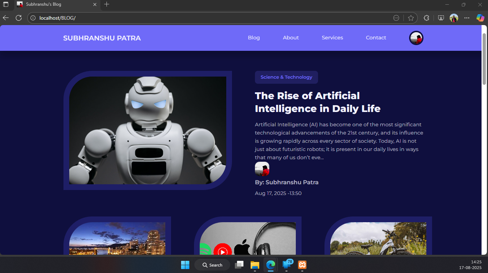
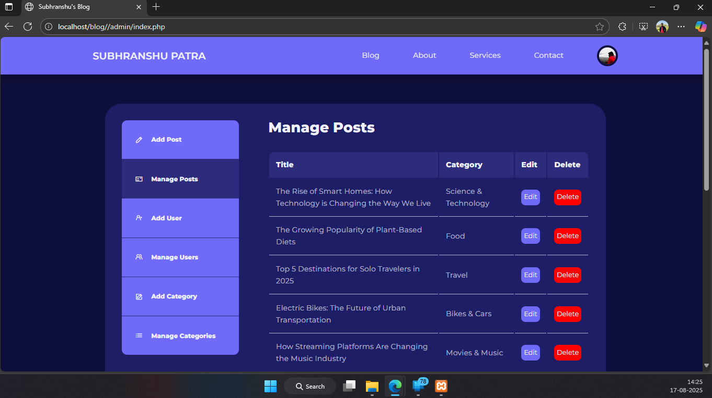
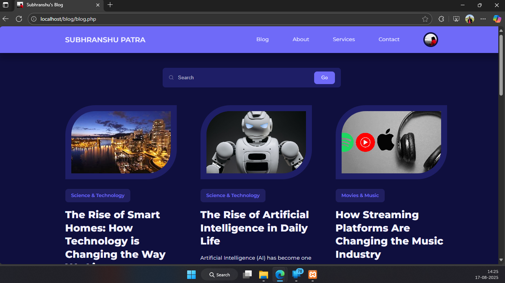

# PHP-MySQL Blog Website with Admin Panel

A fully functional blog website built with **PHP** and **MySQL**, featuring an **admin panel** for managing posts, categories, and users.  
This project is ideal for learning PHP-MySQL CRUD operations, authentication, and basic content management system (CMS) design.

---

## 🚀 Features
- User authentication (login/register with hashed passwords)
- Admin panel for:
  - Managing blog posts
  - Creating categories
  - Managing users
- Blog frontend with categories and featured posts
- Responsive design (Bootstrap)

---

## 🛠️ Tech Stack
- **Frontend:** HTML, CSS, Bootstrap  
- **Backend:** PHP  
- **Database:** MySQL  

---

## 📂 Installation (Localhost with XAMPP)
1. Install [XAMPP](https://www.apachefriends.org/download.html).  
2. Clone this repository into the `htdocs` folder:  
   ```bash
   git clone https://github.com/Subhranshu-Patra29/Subhranshu-s-Blog.git
3. Visit phpMyAdmin(http://localhost/phpmyadmin/), create a new database - blog_db and import the provided SQL file (database.sql) into phpMyAdmin.
4. Start Apache & MySQL from XAMPP.
5. Finally visit: http://localhost/Subhranshu-s-Blog

---

## 📸 Screenshots

### 🏠 Homepage


### ✍️ Admin Panel


### 📄 Blog Post

